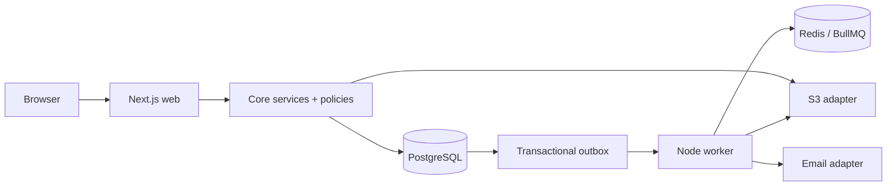

# Архитектура Garun Workspace

Garun Workspace — TypeScript-монорепозиторий и модульный монолит. Next.js отвечает за UI и HTTP
composition, отдельный Node worker — за долгие и повторяемые операции. PostgreSQL является
источником истины; Redis/BullMQ планирует delivery/reminders, MinIO/R2-compatible storage хранит
приватные объекты.

Shared packages не знают о HTTP. Route Handlers валидируют transport, но mutation выполняется одним
application service. Tenant определяется только из server session и active membership. Worker
восстанавливает tenant context из durable IDs и повторно проверяет доступ.

Доменные границы: identity/workspaces, clients/projects, workflow, questionnaires, materials/files,
review, approvals/audit, notifications/completion и exports. Feedback SDK, payments, templates и
интеграции не входят в MVP.
