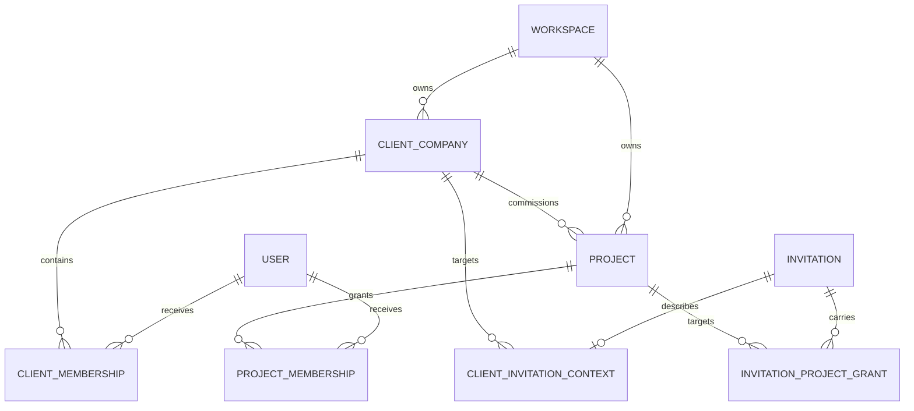

# Клиенты, проекты и доступ Milestone 03

## Поток владельца

1. Владелец создаёт карточку компании. `internalNotes` видны только внутренней стороне.
2. Проект создаётся в статусе `draft`; клиентская сторона его не видит.
3. Владелец проверяет отдельный client preview без impersonation и публикует проект.
4. Приглашение связывает email с одной компанией и явным grant одного проекта. Outbox создаётся в
   той же транзакции и передаёт одноразовую ссылку worker через зашифрованный envelope.
5. Принятие одной ссылки создаёт/восстанавливает membership компании и проекта, создаёт session и
   сразу открывает опубликованный проект. Второе письмо не требуется.
6. Отзыв `ProjectMembership` немедленно закрывает проект. Session пользователя остаётся пригодной
   только для других явно разрешённых ресурсов.

## Матрица разрешений

| Действие                       | Owner |      Employee с grant       |      Client      |  Observer   |
| ------------------------------ | :---: | :-------------------------: | :--------------: | :---------: |
| Видеть внутреннюю карточку     |  да   |             да              |       нет        |     нет     |
| Создавать клиента/проект       |  да   | только workspace permission |       нет        |     нет     |
| Редактировать проект           |  да   |       `project.edit`        |       нет        |     нет     |
| Публиковать                    |  да   |      `project.publish`      |       нет        |     нет     |
| Управлять project memberships  |  да   |  `project.members.manage`   |       нет        |     нет     |
| Видеть опубликованный проект   |  да   |         явный grant         |   явный grant    | явный grant |
| Изменять клиентское содержимое |   —   |              —              | вне Milestone 03 |     нет     |
| Видеть черновик                |  да   |   явный внутренний grant    |       нет        |     нет     |
| Изменять архив                 |  нет  |             нет             |       нет        |     нет     |

Неизвестное разрешение запрещено. UI не является границей безопасности: те же проверки выполняются
в application services и tenant-scoped queries.

## Tenant isolation

- `TenantContext` получается только из проверенной database-backed session и активного
  `WorkspaceMembership`.
- Значения workspace/project/company из URL и form data считаются недоверенными.
- Все мутации проверяют policy и связывают `workspaceId` из server context с искомой сущностью.
- Composite foreign keys запрещают связать компанию, проект, пользователя или invitation из другого
  workspace.
- Клиентский список строится только по активным `ProjectMembership`; membership компании сам по себе
  не даёт доступ ко всем проектам.
- Чужой или недоступный объект возвращает тот же безопасный `404`/not-found state.
- Background email event сохраняет `workspaceId`; raw token отсутствует в обычном payload и логах.

## Модель данных

`Project.statusBeforeArchive` допустим только при `status = archived`. Плановая дата завершения не
может быть раньше даты начала. Сочетания membership side/role ограничены database checks.

## Проверяемые гарантии

- mass-assignment allowlist не принимает `workspaceId`, `status`, `publishedAt` и owner-поля вне
  утверждённого input;
- draft скрыт от client/observer;
- client DTO не содержит внутренних заметок;
- cross-tenant company/project IDs не принимаются;
- grant одного проекта не открывает второй проект той же компании;
- повторное приглашение не создаёт membership-дубликат;
- архив read-only, отзыв доступа действует сразу;
- critical flow и mobile accessibility проверяются Playwright.

Этапы, scope, действия, анкеты, файлы, версии и оплаты намеренно отсутствуют до следующих
milestones.
