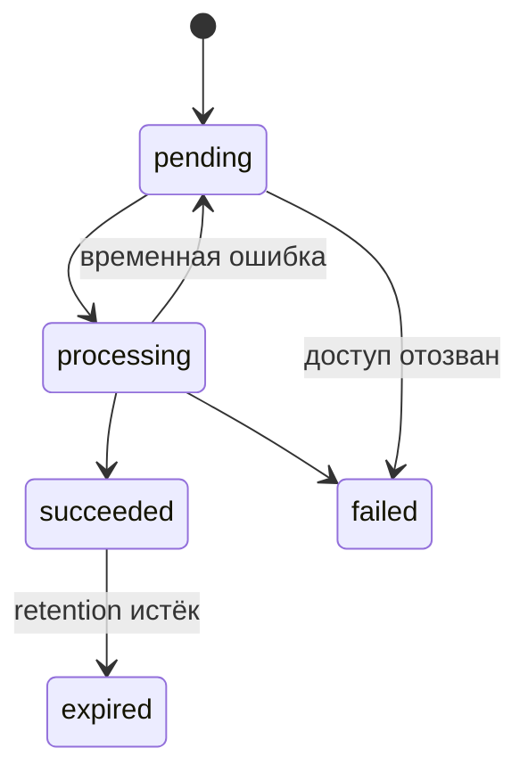
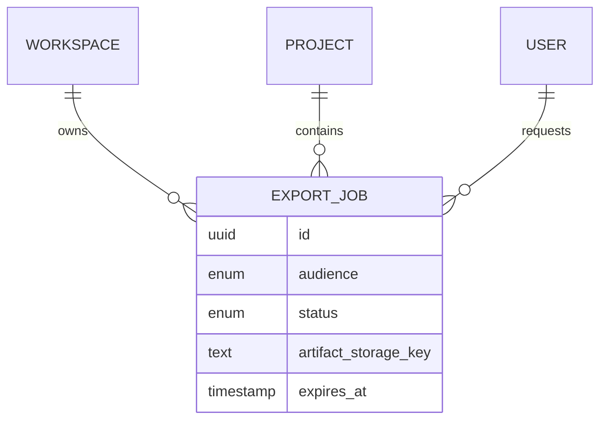

# Экспорт истории и передача проекта

## Назначение

Milestone 10 добавляет асинхронный экспорт проекта для контролируемого пилота. Архив содержит:

- `README.md` — читаемую историю;
- `history.html` — автономную HTML-версию без JavaScript;
- `manifest.json` — версию формата, аудиторию и checksum разрешённых вложений;
- `attachments/` — оригиналы только clean/available файлов, доступных запросившему пользователю.

Формат пакета — `tar.gz`. Он потоково создаётся worker’ом и не требует держать весь архив в памяти.

## Граница доступа

1. Web разрешает workspace из session и активного membership.
2. Project policy требует `project.export`.
3. При создании фиксируется аудитория `internal` либо `client`.
4. Worker повторно проверяет активного пользователя, workspace membership, project membership и
   право на внутреннюю историю.
5. При потере доступа задание завершается безопасным `ACCESS_REVOKED`.
6. Download endpoint ещё раз выполняет policy и разрешает только собственный job.
7. Object key не возвращается клиенту; выдаётся signed GET не дольше общего storage TTL.

Client export исключает draft scope, internal stages/updates/feedback/comments/files и approvals, не
назначенные этому пользователю. Удалённый комментарий становится tombstone без прежнего текста.
HTML экранирует все пользовательские строки и не содержит scripts.

| Роль                   | Запрос | Аудитория                                          | Скачать собственный job |
| ---------------------- | ------ | -------------------------------------------------- | ----------------------- |
| Workspace owner        | Да     | internal                                           | Да                      |
| Internal employee      | Да     | internal при `project.view.internal`, иначе client | Да                      |
| Client                 | Да     | client                                             | Да                      |
| Observer               | Да     | client                                             | Да                      |
| Без project membership | Нет    | —                                                  | Нет                     |

## Состояния и ограничения

`pending → processing → succeeded | failed`; после срока хранения `succeeded → expired`.
Зависший `processing` возвращается в очередь. Retry допускается только для временной ошибки object
storage/источника, максимум пять попыток. Лимиты по умолчанию:

- 1 000 вложений;
- 1 GiB исходных вложений;
- 24 часа хранения готового артефакта;
- три запроса экспорта на пользователя/workspace в час.

Все значения конфигурируемы. Expired object физически удаляет worker. Bucket остаётся приватным.





## Audit

Фиксируются `project.export_requested`, `project.export_completed` и
`project.export_downloaded`. В audit/log не записываются содержимое истории, имена файлов, URL
артефакта, object key, signed URL или checksum целиком.

## Проверка

```powershell
pnpm test
pnpm test:integration
pnpm test:security
pnpm test:e2e
```

Ручная проверка: открыть проект → «Экспорт» → «Создать экспорт», дождаться «Готов» и скачать архив.
Открыть Markdown/HTML, сверить manifest и убедиться, что internal записи отсутствуют в клиентском
экспорте.
