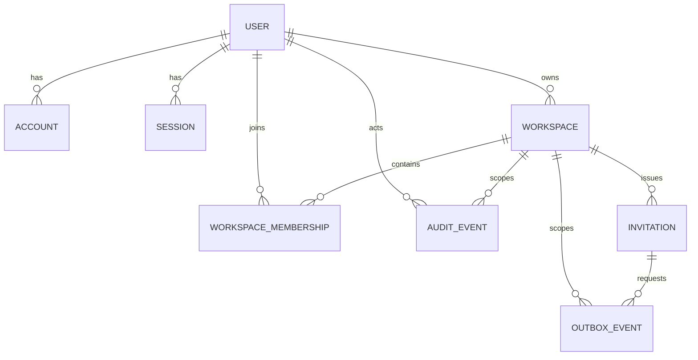

# Identity, workspace и tenant isolation

Документ описывает фактическую реализацию Milestone 02. RLS не используется: граница сейчас обеспечивается session, membership, policy и scoped data access.

## Authentication flow

1. Владелец создаётся только CLI-командой `pnpm bootstrap:owner`; публичного HTTP bootstrap/signup нет.
2. Владелец может войти password flow. Приглашённые участники и владелец могут запросить magic link.
3. UI всегда отвечает одинаково, существует email или нет. Прямые Better Auth signup/password/magic-request paths отключены.
4. Magic token хранится Better Auth только как hash, потребляется атомарно и создаёт database-backed session.
5. Cookie `httpOnly`, `sameSite=lax`, `secure` в production. Origin проверяется Better Auth и общим POST guard.
6. Отзыв session удаляет server-side запись; cookie cache намеренно не включён.

## Invitation flow

1. Только policy `members.invite` создаёт internal member invitation.
2. Email нормализуется, token генерируется криптографически и в `invitation` записывается только SHA-256 hash.
3. В той же транзакции создаются audit и outbox records. Ссылка находится только в AES-GCM envelope, не в JSON payload.
4. Worker отправляет письмо через SMTP adapter/Mailpit, очищает encrypted secret после успеха и применяет bounded retry/backoff.
5. Acceptance блокирует invitation row, повторно проверяет status/expiry, создаёт user и уникальный membership, помечает token использованным и пишет audit в одной транзакции.
6. После acceptance сервер выпускает и немедленно потребляет отдельный hashed Better Auth verification token, создаёт database-backed session и перенаправляет участника прямо в workspace. В браузер не отправляется второе письмо; при редком сбое session issuance уже созданный membership позволяет запросить обычный magic link.

## Permissions matrix

| Permission              | owner | member |
| ----------------------- | :---: | :----: |
| `workspace.view`        |  да   |   да   |
| `members.invite`        |  да   |  нет   |
| `members.manage`        |  да   |  нет   |
| `sessions.revoke.other` |  да   |  нет   |

Незнакомые permissions запрещены. Disabled membership и suspended workspace запрещают все действия. Owner membership нельзя отключить через Milestone 02 UI.

## Tenant resolution

```text
request -> Better Auth session -> active user -> membership by user + server-side slug
        -> active workspace -> TenantContext -> policy -> workspace-scoped query
```

Переданный клиентом `workspaceId` не используется как authority. Чужой slug, подмена ID в body/query и отсутствующий объект возвращают одинаковый безопасный отказ. Worker проверяет `workspace_id` outbox event при разрешении invitation recipient.

## Data model



`verification` принадлежит Better Auth и хранит hashed magic tokens, включая короткоживущий token для server-side session issuance после acceptance. `rate_limit` поддерживает multi-instance rate limiting Better Auth. Unique constraints запрещают дублирующий membership и два pending invitations на один email/workspace.

## Audit allowlist

Записываются bootstrap, magic-link request, login, logout, session revoke, invitation create/resend/revoke/accept, membership create/disable и значимый access denied. Metadata допускает masked email, reason code, source и target user ID. Token, URL, cookie, authorization header, полный email body и secrets запрещены.
