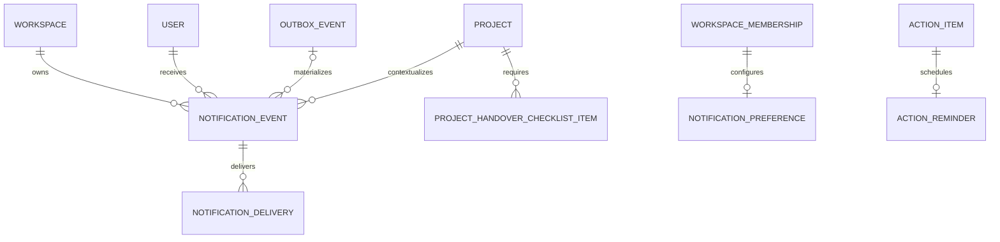

# Уведомления, reminders, завершение и архив

Документ описывает реализацию Milestone 09. Источник истины для доступа — проверенная session,
активное workspace/project membership и server policy. Уведомление или deep link никогда не
предоставляют доступ сами по себе.

## Поток доставки

1. Бизнес-сервис сохраняет изменение, audit и `outbox_event` одной PostgreSQL-транзакцией.
2. Dispatcher атомарно забирает pending outbox row и передаёт в BullMQ только ID события и
   workspace context.
3. Worker восстанавливает actor, project и получателей tenant-scoped запросом, исключает автора и
   создаёт идемпотентный `notification_event`.
4. In-app delivery сразу получает `delivered`. Email delivery учитывает preference и quiet hours.
5. BullMQ выполняет delayed email с максимум восемью попытками и exponential backoff. Failed job
   не удаляется и является локальным DLQ для диагностики.
6. Перед SMTP worker заново проверяет активного пользователя и workspace membership. Для reminder
   дополнительно проверяется, что action всё ещё `open`/`in_progress`.

Redis/SMTP outage не откатывает бизнес-операцию. Redis outage возвращает outbox в pending; SMTP
outage оставляет delivery retryable. Dedupe key и unique channel constraint исключают повторный
видимый экземпляр при replay.

## Каталог событий

| Событие                      | Получатель                               | Deep link     | Email |
| ---------------------------- | ---------------------------------------- | ------------- | ----- |
| `action.created`             | назначенный исполнитель                  | План          | да    |
| `action.reminder.due_soon`   | назначенный исполнитель                  | План          | да    |
| `action.reminder.overdue`    | назначенный исполнитель                  | План          | да    |
| `material.requested`         | пользователь, у которого нужны материалы | Материалы     | да    |
| `site_version.published`     | активные участники проекта               | Проверка      | да    |
| `feedback.created`           | внутренняя команда и owner               | Проверка      | да    |
| `feedback.comment_added`     | другая сторона client-visible обсуждения | Проверка      | да    |
| `approval.requested`         | назначенные approvers                    | Согласования  | да    |
| `approval.approved`          | автор запроса                            | Согласования  | да    |
| `approval.changes_requested` | автор запроса                            | Согласования  | да    |
| `project.completed`          | активные участники проекта               | Обзор проекта | да    |
| `project.archived`           | активные участники проекта               | Обзор проекта | да    |

Автор события исключается. Неизвестный event type получает нейтральный allowlisted текст без
сырого payload. Приглашения и magic links используют тот же transactional outbox, но отдельные
защищённые шаблоны; пользовательская настройка проектных писем их не отключает.

## Preferences и тихие часы

- `emailEnabled` управляет проектными email, но не in-app каналом.
- `remindersEnabled` запрещает создание новых action reminders.
- timezone — валидный IANA identifier, по умолчанию timezone workspace.
- quiet hours задаются парой минут `0..1439`, поддерживают переход через полночь.
- во время quiet hours in-app появляется сразу, email job получает `availableAt` окончания окна.

Настройки tenant-scoped по `(workspaceId, userId)`. Некорректный timezone или только одна граница
quiet hours отклоняются стабильной безопасной ошибкой.

## Completion gate

Завершить проект может только actor с явным `project.complete`. В текущей модели owner имеет это
право по роли; другим внутренним участникам его можно выдать explicit grant.

Все условия обязательны:

1. Каждый required stage имеет `approved` или `skipped` с непустой причиной.
2. Нет blocking action в `open`/`in_progress`.
3. Последний request типа `final_handover` имеет `approved`.
4. Выполнены четыре фиксированных handover item: production URL, передача доступов, backup,
   инструкция.

UI показывает состояние условий, но окончательная проверка повторяется в транзакции под project row
lock. Повторный запрос completion идемпотентен. Financial gate появится только вместе с включённым
payment module и обязательным unpaid milestone.

## Архив

Архив сохраняет `statusBeforeArchive`, переводит проект в `archived` и создаёт audit/outbox.
Server policy разрешает только чтение; disabled controls являются лишь UX-проекцией этой политики.
Восстановить проект может owner, после чего возвращается точный предыдущий статус, включая
`completed`.

## Permissions

| Действие                       | Owner | Internal explicit grant | Client |
| ------------------------------ | ----- | ----------------------- | ------ |
| Читать собственный inbox       | да    | да                      | да     |
| Изменять свои preferences      | да    | да                      | да     |
| Читать чужой inbox/delivery    | нет   | нет                     | нет    |
| Управлять checklist/completion | да    | `project.complete`      | нет    |
| Архивировать проект            | да    | `project.archive`       | нет    |
| Восстановить архив             | да    | нет                     | нет    |

## ER-схема Milestone 09

Composite foreign keys связывают notification, delivery, reminder и checklist с тем же
workspace/project. Raw token, email body, cookie, authorization header и полный URL в этих таблицах
и BullMQ payload не хранятся.

## Диагностика без утечки данных

Логи queue содержат только job ID/name и безопасный error code. Failed delivery диагностируется по
`status`, `attempts`, `availableAt`, `lockedAt` и `lastErrorCode`. В логи и queue payload запрещены
email body, deep-link URL, token, cookie, preview password, authorization header и содержимое
проекта.
