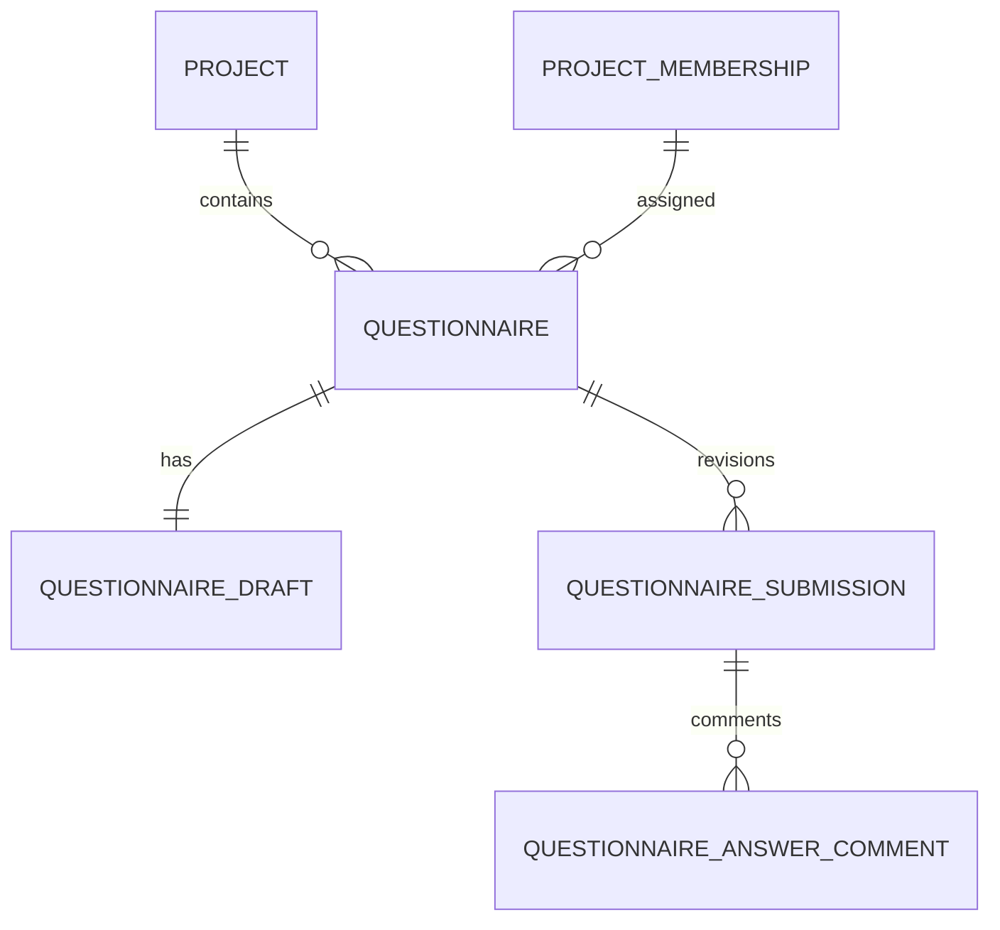

# Анкеты и сбор информации

## Граница Milestone 05

Анкета создаётся внутри конкретного проекта, назначается одному активному client project member и
сразу становится доступна ему для заполнения. Workspace-библиотека reusable templates, импорт,
AI-generation и аналитика ответов в milestone не входят.

File/image входят в schema contract для совместимости будущих версий, но конструктор не показывает
их до готовности Milestone 06. Заглушки загрузки и публичные file URL не используются.

## Поток

1. Участник команды с `project.edit` открывает «Анкеты» в карточке проекта.
2. Конструктор создаёт sections и поля, назначает client member и сохраняет валидированный schema
   snapshot.
3. Клиент открывает deep link анкеты. Каждый change ставится в очередь autosave с debounce.
4. Autosave передаёт expected `version` и idempotency key. Успех возвращает новый version, progress
   и server save time. Stale tab получает `409 CONFLICT` и больше не пишет до reload.
5. Submit под транзакционной блокировкой проверяет текущую version, required/conditional rules и
   создаёт immutable `QuestionnaireSubmission`.
6. Разработчик принимает revision или возвращает её с обязательным пояснением.
7. При clarification исходная submission не меняется, draft переоткрывается с последними
   подтверждёнными ответами. Следующая отправка получает следующий revision.
8. Комментарии хранятся отдельно и привязаны к конкретным submission и field ID.

## Поддерживаемая schema v1

- sections с title/description;
- `short_text`, `long_text`, `number`, `email`, `phone`, `url`, `single_choice`,
  `multiple_choice`, `date`, `toggle`, `repeating_group`, `info`;
- `file` и `image` распознаются reader/validator, но запрещены при создании до Milestone 06;
- required, hint, example, options;
- conditional `equals`, `not_equals`, `contains`, `truthy`;
- один уровень repeating group, до 50 rows;
- до 20 sections, 100 fields, 20 child fields и 256 KB draft JSON.

Condition ссылается только на предыдущее поле. Это исключает циклы и делает порядок вычисления
однозначным. При submit скрытые condition fields удаляются из нормализованного snapshot.

## Модель данных

- `questionnaire`: tenant/project, schema snapshot, assignee, status и dates;
- `questionnaire_draft`: mutable answers, optimistic version, idempotency и last saved time;
- `questionnaire_submission`: revision, duplicated schema snapshot, normalized immutable answers и
  review state;
- `questionnaire_answer_comment`: отдельная линейная заметка к field конкретной revision.

Миграции `0006` и `0007` создают таблицы, composite tenant constraints и trigger
`questionnaire_submission_content_immutable`.

## Permissions

| Действие                         | Owner/project editor | Назначенный client | Другой client/observer |
| -------------------------------- | -------------------- | ------------------ | ---------------------- |
| Список анкет проекта             | Да                   | Только свои        | Только свои/нет        |
| Создать и назначить              | Да                   | Нет                | Нет                    |
| Читать незавершённый draft       | Нет                  | Да                 | Нет                    |
| Autosave/submit                  | Нет                  | Да                 | Нет                    |
| Читать отправленные revisions    | Да                   | Да                 | Нет                    |
| Accept/request clarification     | Да                   | Нет                | Нет                    |
| Комментарий к доступной revision | Да                   | Да                 | Нет                    |

Tenant берётся только из session → active workspace membership. Project и questionnaire разрешаются
server-side; ID из URL/body не меняют tenant context. Архивный проект read-only.

## Privacy и события

Audit фиксирует создание, submit, review и комментарий, но не текст вопросов, answers, comment body
или draft. Domain outbox содержит только workspace/project/entity IDs. Autosave не логируется как
audit event, чтобы не создавать шум и риск копирования PII.

## Проверка

Unit tests покрывают schema compatibility, conditions, repeating groups, progress и validation.
Integration tests проверяют persistence, idempotency, stale conflict, cross-tenant отказ, immutable
revision, clarification/resubmit, comments, audit/outbox. Playwright выполняет полный flow на
desktop/mobile и axe scan.
